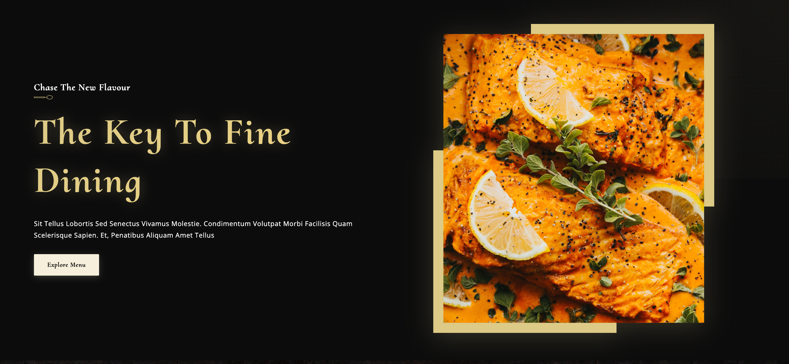
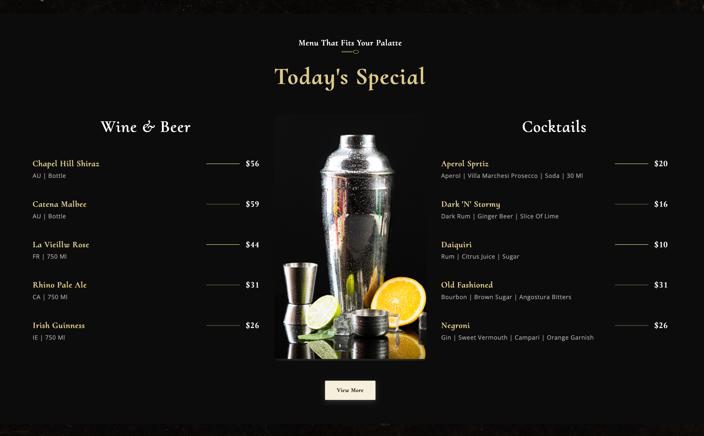
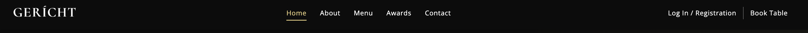
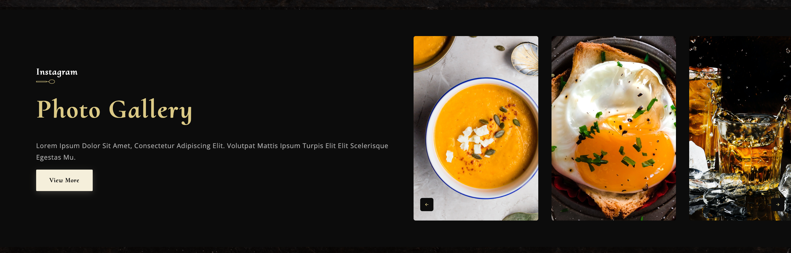
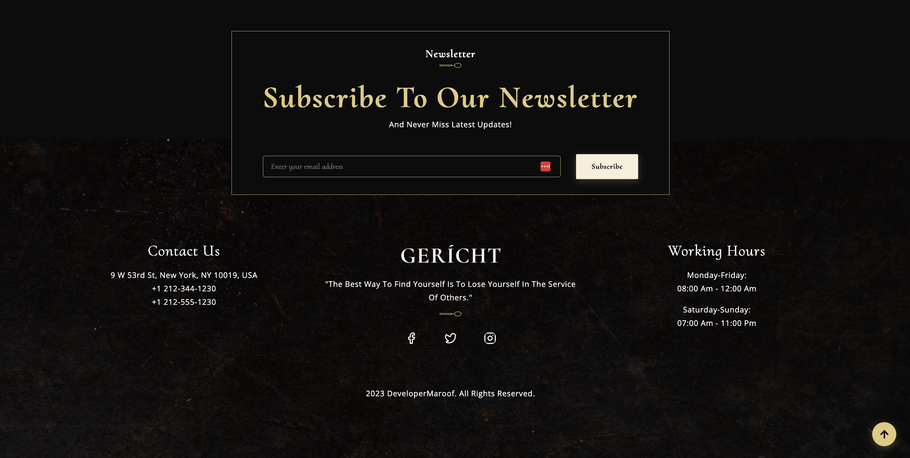
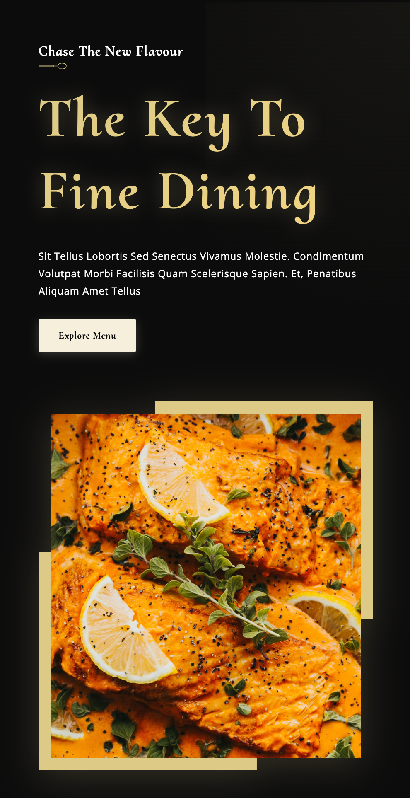
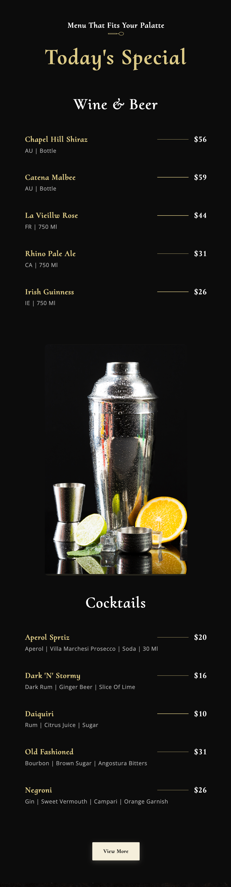

# 🍽️ Gericht Restaurant - Fine Dining Website

A modern, elegant, and fully responsive restaurant website built with React. This production-ready website showcases a premium dining experience with smooth animations, beautiful UI/UX, and professional design.


## ✨ Features

### 🎨 **Design & UI/UX**

- **Modern & Elegant Design** - Premium dark theme with golden accents
- **Fully Responsive** - Seamlessly adapts to all devices (mobile, tablet, desktop)
- **Smooth Animations** - Fade-in, slide-in, and scale animations for enhanced user experience
- **Interactive Elements** - Hover effects, transitions, and micro-interactions throughout
- **Custom Scrollbar** - Styled scrollbar matching the website theme

### 🚀 **Performance & Functionality**

- **Sticky Navigation Bar** - Fixed navbar with scroll effects and active section highlighting
- **Smooth Scrolling** - Seamless navigation between sections
- **Scroll-to-Top Button** - Convenient button appears after scrolling
- **Newsletter Subscription** - Email validation and user feedback
- **Video Integration** - Interactive video player with play/pause controls
- **Image Gallery** - Scrollable gallery with smooth transitions

### 📱 **User Experience**

- **Mobile-First Design** - Optimized for mobile devices
- **Touch-Friendly** - Large tap targets and smooth gestures
- **Fast Loading** - Optimized performance and quick page loads
- **Accessibility** - ARIA labels and semantic HTML
- **SEO Optimized** - Meta tags, Open Graph, and Twitter cards

### 🎯 **Key Sections**

- **Hero Section** - Eye-catching header with call-to-action
- **About Us** - Restaurant history and story
- **Special Menu** - Interactive menu display with wine & cocktails
- **Chef's Word** - Personal message from the chef
- **Awards & Recognition** - Showcase of achievements
- **Photo Gallery** - Instagram-style image gallery
- **Contact & Location** - Find us section with working hours
- **Newsletter** - Email subscription with validation
- **Social Media** - Integrated social media links

## 🛠️ Tech Stack

- **React 18.2.0** - Modern UI library
- **React Icons** - Icon library for social media and UI elements
- **CSS3** - Custom styling with animations and transitions
- **JavaScript ES6+** - Modern JavaScript features
- **Create React App** - Development environment

## 📸 Screenshots

### Desktop View


_Homepage - Desktop View_


_Menu Section - Desktop View_


_Sticky Navigation with Active States_


_Interactive Photo Gallery_


_Footer with Social Media Links_

### Mobile View


_Homepage - Mobile View_


_Menu Section - Mobile View_

## 🚀 Getting Started

### Prerequisites

- Node.js (v14 or higher)
- npm or yarn

### Installation

1. **Clone the repository**

   ```bash
   git clone https://github.com/yourusername/gericht-restaurant.git
   cd gericht-restaurant
   ```

2. **Install dependencies**

   ```bash
   npm install
   ```

3. **Start the development server**

   ```bash
   npm start
   ```

4. **Open your browser**
   - Navigate to `http://localhost:3000`
   - The page will reload automatically when you make changes

### Build for Production

```bash
npm run build
```

This creates an optimized production build in the `build` folder.

## 📁 Project Structure

```
gericht-restaurant/
├── public/                  # Public assets
│   ├── index.html
│   └── ...
├── screenshots/             # Project screenshots
│   ├── homedesktop.png
│   ├── mobileviewhome.png
│   └── ...
├── src/
│   ├── components/          # Reusable UI components
│   │   ├── Footer/
│   │   │   ├── Newsletter.jsx
│   │   │   ├── FooterOverlay.jsx
│   │   │   └── index.js
│   │   ├── MenuItem/
│   │   │   ├── MenuItem.jsx
│   │   │   ├── MenuItem.css
│   │   │   └── index.js
│   │   ├── Navbar/
│   │   ├── ScrollToTop/
│   │   ├── SubHeading/
│   │   └── index.js         # Component exports
│   ├── container/          # Page sections/containers
│   │   ├── AboutUs/
│   │   ├── Chef/
│   │   ├── Footer/
│   │   ├── Gallery/
│   │   ├── Header/
│   │   ├── Intro/
│   │   ├── Laurels/
│   │   ├── Menu/
│   │   ├── Findus/
│   │   └── index.js         # Container exports
│   ├── constants/           # Constants and data
│   │   ├── data.js          # Menu data
│   │   ├── images.js        # Image imports
│   │   └── index.js
│   ├── assets/              # Static assets
│   │   ├── images/          # All PNG/JPG images
│   │   ├── videos/          # Video files
│   │   └── icons/           # SVG icons
│   ├── hooks/               # Custom React hooks
│   │   └── useScrollAnimation.js
│   ├── utils/               # Utility functions
│   │   └── index.js
│   ├── App.js
│   ├── App.css
│   └── index.js
├── .gitignore
├── package.json
└── README.md
```

## 🎨 Customization

### Colors

Edit the CSS variables in `src/index.css`:

```css
:root {
  --color-golden: #dcca87;
  --color-black: #0c0c0c;
  --color-white: #ffffff;
  /* ... */
}
```

### Content

- Update menu items in `src/constants/data.js`
- Modify images in `src/constants/images.js`
- Edit section content in respective component files

## 🌐 Live Demo

🔗 **[View Live Demo](https://your-demo-link.com)** _(Add your deployed link here)_

## 📱 Responsive Breakpoints

- **Mobile**: < 650px
- **Tablet**: 650px - 1150px
- **Desktop**: > 1150px
- **Large Desktop**: > 2000px

## ✨ Key Highlights

- ✅ Production-ready code
- ✅ Fully responsive design
- ✅ Smooth animations and transitions
- ✅ SEO optimized
- ✅ Fast loading times
- ✅ Accessible and user-friendly
- ✅ Modern React best practices
- ✅ Clean and maintainable code

## 🤝 Contributing

This is a portfolio project, but suggestions and feedback are welcome!

## 📄 License

This project is open source and available under the [MIT License](LICENSE).

## 👨‍💻 Developer

**DeveloperMaroof**

- Portfolio: [Your Portfolio Link]
- LinkedIn: [Your LinkedIn]
- Email: [Your Email]

---

⭐ **Star this repo if you find it helpful!**

---

**Made with ❤️ by DeveloperMaroof**
